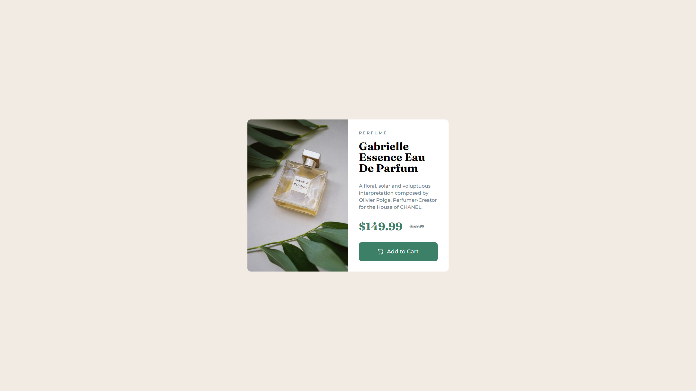
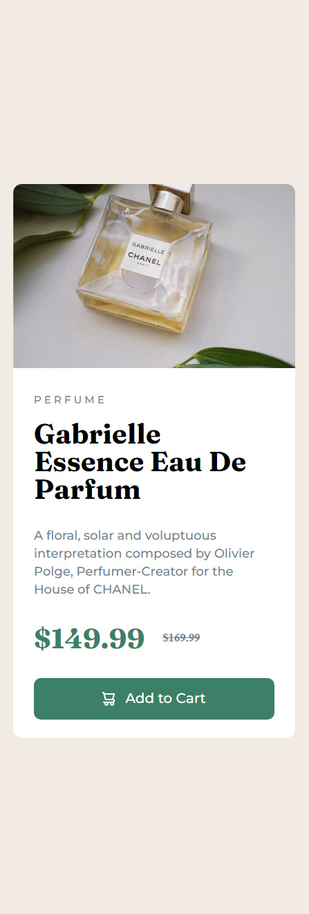

# Frontend Mentor - Product preview card component solution

This is a solution to the [Product preview card component challenge on Frontend Mentor](https://www.frontendmentor.io/challenges/product-preview-card-component-GO7UmttRfa). Frontend Mentor challenges help you improve your coding skills by building realistic projects.

## Table of contents

- [Overview](#overview)
  - [Screenshot](#screenshot)
  - [Links](#links)
- [My process](#my-process)
  - [Built with](#built-with)
  - [What I learned](#what-i-learned)
- [Author](#author)

## Overview

### The challenge

Users should be able to:

- View the optimal layout depending on their device's screen size
- See hover and focus states for interactive elements

### Screenshot

### Links

- Solution URL: [https://github.com/Velarion/Frontend-Mentor-Product-Card](https://github.com/Velarion/Frontend-Mentor-Product-Card)
- Live Site URL: [https://velarion.github.io/Frontend-Mentor-Product-Card/](https://velarion.github.io/Frontend-Mentor-Product-Card/)

## My process

### Built with

- Semantic HTML5 markup
- CSS
- SCSS
- Flexbox
- Grid

### What I learned

During the making of this component I've spent a lot of time figuring
out how to structure it precisely without losing one half. I also
made use of a wrapper to ensure that the space outside the text part
was correct.

With some research I managed to size the picture in the right format
for both desktop and mobile. Flex was definitely helpful to ensure
that the items would stack once reaching a certain point for mobile.

## Author

- Frontend Mentor - [@velarion](https://www.frontendmentor.io/profile/velarion)
